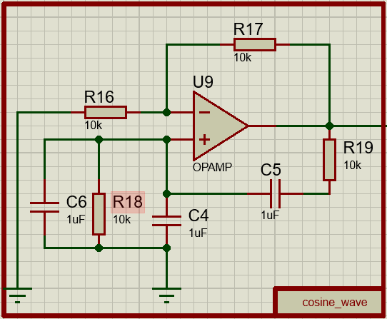
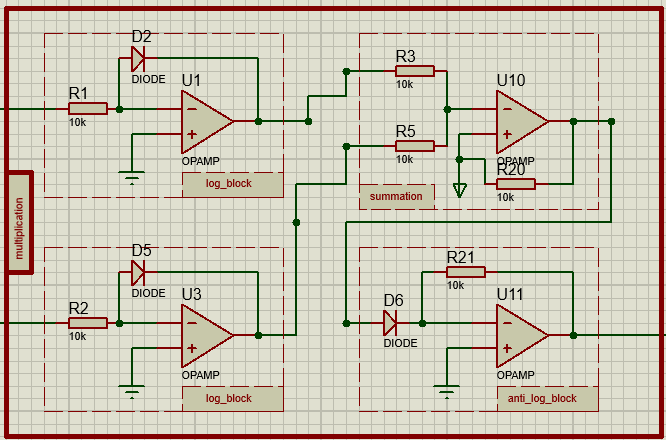
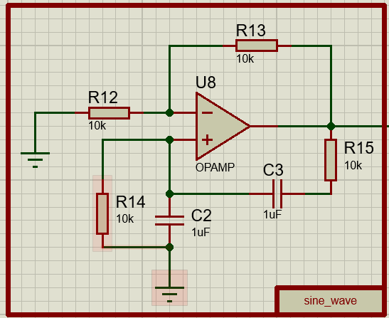
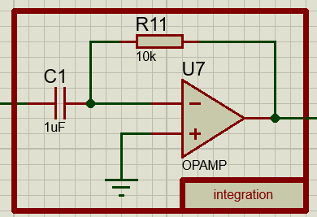
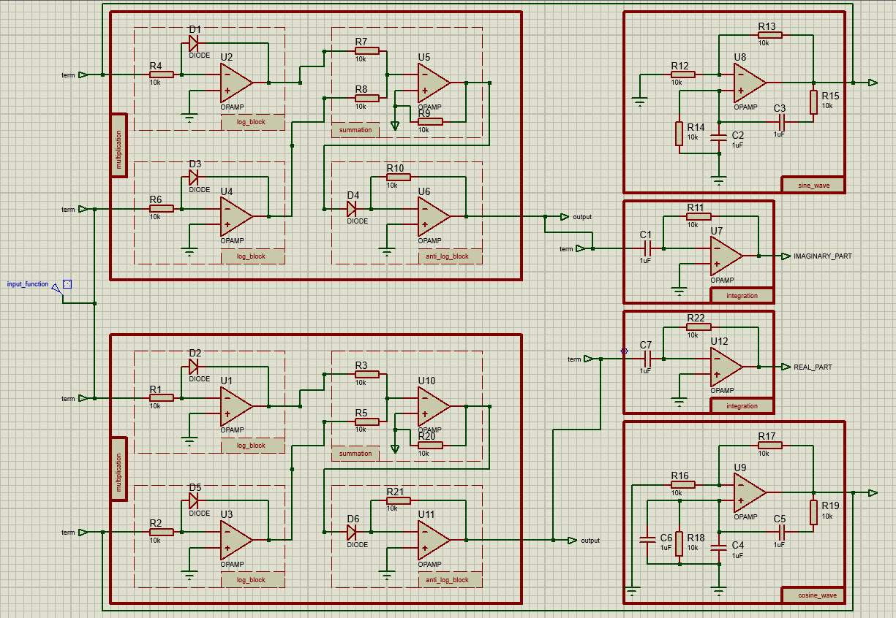
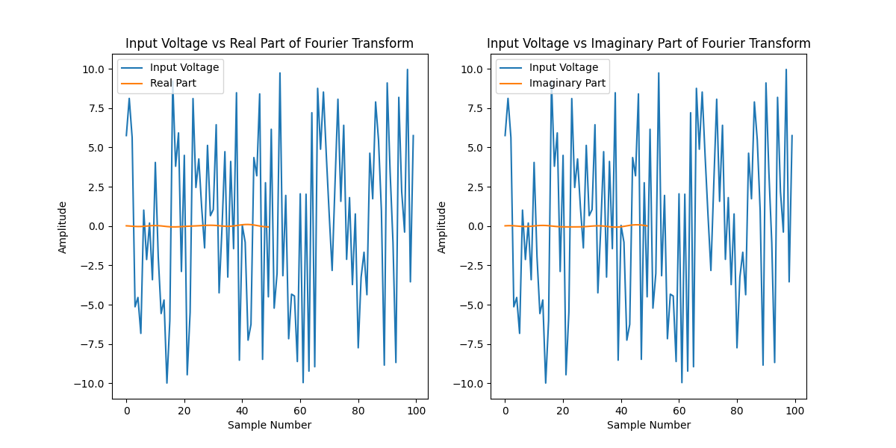

# Fourier Transform Simulation using Op-Amp-Inspired Circuits 

This project simulates a fourier  transformation using hardware circuits designed with operational amplifiers (Op-Amps). The model is based on a simple structure with a continuos data dependent function. The components required for this simulation include multiplication, integration, sine generator and cosine generator blocks.

## Project Overview

The project consists of the following main components:

- **Fourier transform Class**: A simple fourier transform is implemented .
- **Hardware Circuit**: A hardware-based circuit that mimics the model, using Op-Amps for multiplication, integration, sine generator and cosine generator blocks.
- **Simulation Outputs**: The simulation results are generated as text files and a plot.

## Model

The model is implemented in python as a simple class with a input function and coefficients. The class includes:

- A `compute_coefficients` function compute the Fourier transform coefficients (real and imaginary) at a given frequency.
- A `compute_spectrum` function compute the Fourier transform over a range of frequencies.

### Code:
```python
import numpy as np

class FourierTransform:
    def __init__(self, input_signal, sampling_rate):
        self.input_signal = np.array(input_signal)
        self.sampling_rate = sampling_rate
        self.time = np.arange(len(input_signal)) / sampling_rate
    
    def compute_coefficients(self, frequency):
        omega = 2 * np.pi * frequency
        cosine_wave = np.cos(omega * self.time)
        sine_wave = np.sin(omega * self.time)
        
        real_part = self.input_signal * cosine_wave
        imaginary_part = self.input_signal * sine_wave
        
        real_coefficient = np.trapz(real_part, dx=1/self.sampling_rate)
        imaginary_coefficient = np.trapz(imaginary_part, dx=1/self.sampling_rate)
        
        return {
            'real': real_coefficient,
            'imaginary': imaginary_coefficient
        }
    
    def compute_spectrum(self, freq_range):
        spectrum = {}
        for freq in freq_range:
            spectrum[freq] = self.compute_coefficients(freq)
        
        return spectrum
```

## Hardware Circuit Diagram

The hardware simulation is implemented using operational amplifier (Op-Amp) circuits. The circuit is divided into several blocks:

1. **cosine Block**: This block simulates wein bridge oscillator.



2. **Multiplication Block**: This block performs multiplication of inputs.



3. **sine Block**:This block simulates wein bridge oscillator.



4. **integration Block**: This block implements the integration.



### Circuit Diagram:



## Simulation Outputs

The Proteus simulation generates three key text files:

1. **input.txt**: Contains the input data .
2. **output.txt**: Contains the output generated by the modle having both real and imaginary values.

Additionally, plot of the output is provided to visualize the relationship between the input and output.

### 3D Plot of Neuron Output:



## Running the Simulation

1. Clone the repository:
    ```bash
    git clone https://github.com/yourusername/neuron-hardware-simulation.git
    cd neuron-hardware-simulation
    ```

2. Set up the Proteus simulation with the appropriate circuit blocks for multiplication, integration, sine generator and cosine generator blocks.

3. Run the simulation in Proteus to generate the output text files and the plot.

4. Check the generated files:
    - `input.txt`: Contains input data for the neuron.
    - `output.txt`: Contains the output data after applying the fourier transform.

5. View the output plot (`output_plot.png`) to analyze the results.

## Conclusion

This project demonstrates how to implement a simple fourier transform using hardware circuits, specifically Op-Amps. The simulation results can be used to study the behavior of DC voltages in hardware and gain insights into signal operations at the circuit level.


